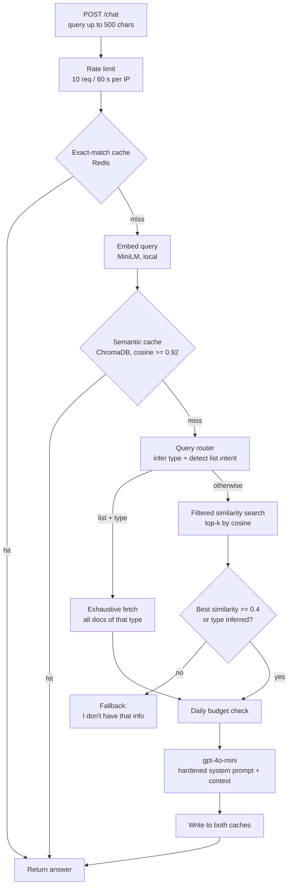

# PersonaRAG

**A production-ready RAG API that lets visitors chat with my portfolio.**


PersonaRAG is the backend behind the "Ask Pranav's AI Assistant" chatbot on my [portfolio website](https://pranavsasank-portfolio.vercel.app). A visitor types a question ("What projects has Pranav built?", "Does he have any certifications?", "How do I contact him?") and the API answers it using only facts from my real portfolio content, with no guessing and no invented details.

It is written in plain Python with no LangChain or LlamaIndex, so every stage of the pipeline (routing, retrieval, caching, guardrails, generation) is explicit and readable.

---

## Table of contents

- [Why I built it](#why-i-built-it)
- [Highlights](#highlights)
- [Architecture](#architecture)
- [How it works](#how-it-works)
- [Tech stack](#tech-stack)
- [Repository structure](#repository-structure)
- [API reference](#api-reference)
- [Getting started](#getting-started)
- [Configuration](#configuration)
- [Docker](#docker)
- [Design decisions](#design-decisions)
- [Limitations and roadmap](#limitations-and-roadmap)
- [Author](#author)

---

## Why I built it

A portfolio is static. Recruiters and collaborators have to scroll through sections to find what matters to them, and most won't. An assistant that answers questions directly is faster for them and a better showcase for me.

A public chatbot backed by a paid LLM also brings real engineering problems: hallucinations, prompt injection, abuse, and runaway cost. PersonaRAG is my attempt to solve those properly instead of wrapping a single prompt around an API call.

## Highlights

- **Grounded answers only.** The model sees just the retrieved portfolio snippets. If the answer isn't there, it says so instead of making something up.
- **Metadata-aware query routing.** A keyword router infers what a question is about (project, skill, education, certification, course, contact, about) and restricts retrieval to that document type before ranking.
- **Two retrieval modes.** Similarity search for "tell me about X" questions, and exhaustive fetch for "list all X" questions, so lists are complete rather than truncated at top-k.
- **Conversational follow-ups.** An LLM query-rewriting step turns a follow-up like "what tech did it use?" into a standalone question.
- **Two-layer caching.** An exact-match Redis cache and a semantic (embedding-similarity) cache in ChromaDB avoid repeat LLM calls and return cached answers in around 0.2 s.
- **Built-in cost and abuse protection.** Per-IP rate limiting, a daily LLM call budget, a 500-character input cap, a hardened system prompt, and locked-down CORS.
- **Zero-cost embeddings.** Runs a local sentence-transformers model, so only generation touches a paid API.
- **Container-ready.** A slim Dockerfile with CPU-only PyTorch and a pre-cached embedding model for fast cold starts.

## Architecture



## How it works

### 1. Knowledge base

The source of truth is `content.json`, my portfolio content. It is refined into `backend/Data/documents.jsonl`, a curated set of single-topic documents (about, skills, projects, education, certifications, courses, contact, and suggested topics). Each document has an `id`, its `text`, and a `metadata` object that includes a `type`.

Every document is a complete unit on one topic, so **each document is embedded as a single chunk with no further text splitting**. Splitting would only fragment context that was written to stand alone.

### 2. Ingestion

`rag/ingest.py` loads the documents, embeds them with `sentence-transformers/multi-qa-MiniLM-L6-cos-v1` (normalized vectors), and stores them in a persistent ChromaDB collection using cosine distance. Rebuilding the index also clears the semantic cache, so stale answers never outlive the content they were based on.

### 3. Query routing

Before any vector search, the query is scanned with keyword patterns (`rag/config.py`):

| Inferred type | Example trigger words |
|---|---|
| `project` | project, built, app, application |
| `skill` | skill, technology, language, framework, tool |
| `education` | education, degree, college, university, cgpa |
| `certification` | certification, certificate, certified |
| `course` | course, learned, studied |
| `contact` | contact, email, linkedin, github, reach |
| `about` | located, based, role, looking for |

A second pattern detects **list intent** ("all", "list", "every", "what are", "how many"). The router matters because broad documents (like a general "about" entry) tend to outrank specific ones in pure vector search. Filtering by type first fixes that.

### 4. Retrieval

- **Similarity mode** (`search`): a cosine-ranked query over ChromaDB, filtered by the inferred type if there is one, returning the top 3 documents. If the inferred type has 10 or fewer documents in total, `top_k` widens to cover all of them, so a question about "projects" sees every project.
- **List mode** (`fetch_all`): when the query has list intent and a known type, retrieval skips ranking entirely and fetches every document of that type. Completeness beats relevance ordering for "list all my projects".

### 5. Relevance threshold

If nothing was routed by type and the best match scores below `0.4` cosine similarity, the API returns a fixed fallback message instead of calling the LLM. Off-topic questions cost nothing and can't produce hallucinations.

### 6. Query rewriting

When conversation history is present, a cheap `temperature=0` LLM call rewrites the follow-up into a standalone question ("what tech did it use?" becomes "What technologies were used in the X project?"). If the rewrite fails, the original query is used.

### 7. Generation

The retrieved documents are joined into a context block and sent to `gpt-4o-mini` with a system prompt that:

- restricts answers to the provided context and says so when the answer isn't there
- speaks about Pranav in the third person
- enforces a scannable format (short paragraphs, bulleted lists, bolded technologies)
- refuses role-play and ignores instructions embedded in the user's message

In list mode an extra instruction tells the model to enumerate every item, one line each, and then offer more detail.

### 8. Caching

| Layer | Storage | Match | TTL / lifecycle |
|---|---|---|---|
| Exact-match | Upstash Redis | SHA-256 of the normalized query, namespaced by a hash of `documents.jsonl` | 7 days; editing the documents changes the hash and invalidates everything |
| Semantic | ChromaDB `semantic_cache` collection | Cosine similarity >= 0.92 against past queries | Cleared on every index rebuild |

A semantic hit also populates the exact-match cache for next time.

### 9. Safety and cost controls

- **Prompt-injection hardening** in the system prompt
- **500-character input cap** enforced by the request model
- **Per-IP rate limit** of 10 requests per 60 seconds, via Redis
- **Daily LLM budget**: a counter checked before every generation call (default 500 calls per day, configurable with `DAILY_LLM_BUDGET`)
- **CORS allow-list**: only the local dev origin, the deployed portfolio, and anything in `FRONTEND_URL`
- **Graceful degradation**: if Redis is unavailable or unconfigured, caching and rate limiting switch off instead of crashing the API

## Tech stack

| Component | Choice |
|---|---|
| API | FastAPI + Uvicorn |
| Embeddings | `sentence-transformers/multi-qa-MiniLM-L6-cos-v1` (local) |
| Vector database | ChromaDB (persistent, on disk, cosine space) |
| LLM | OpenAI `gpt-4o-mini` |
| Cache and rate limiting | Upstash Redis (REST) |
| Package manager | [uv](https://github.com/astral-sh/uv) |
| Packaging | Docker (Python 3.12 slim, CPU-only PyTorch) |

## Repository structure

```
PersonaRAG/
├── content.json               # Source portfolio content
└── backend/
    ├── main.py                # FastAPI app: /chat, /health, CORS
    ├── rag/
    │   ├── config.py          # Models, thresholds, router keyword patterns
    │   ├── ingest.py          # Build the ChromaDB index from documents.jsonl
    │   ├── retrieval.py       # Embeddings, type routing, search, semantic cache
    │   ├── generation.py      # Orchestration: cache, rewrite, retrieve, generate
    │   └── cache.py           # Redis cache, rate limiter, daily budget
    ├── Data/
    │   └── documents.jsonl    # Curated single-topic documents
    ├── chroma_db/             # Persisted vector index
    ├── test_chat.py           # Console tester (no frontend needed)
    ├── Dockerfile
    ├── pyproject.toml / uv.lock / requirements.txt
    └── .env.example
```

## API reference

Base URL (local): `http://localhost:8000`

### `POST /chat`

Request:

```json
{ "query": "What projects has Pranav built?" }
```

Response:

```json
{ "answer": "..." }
```

| Status | Meaning |
|---|---|
| `200` | Answer returned. Rate-limit, budget, and fallback messages are also returned as normal answers so the chat UI can display them. |
| `422` | Invalid body, for example a query longer than 500 characters. |
| `500` | Unexpected failure while generating an answer. |

```bash
curl -X POST http://localhost:8000/chat \
  -H "Content-Type: application/json" \
  -d '{"query": "What are Pranav'\''s main skills?"}'
```

### `GET /health`

Returns `{ "status": "ok" }`. Use it for uptime checks and container health probes.

### How different questions are handled

| Question | Route |
|---|---|
| "List all of Pranav's projects" | List intent + `project` type, so an exhaustive fetch of every project |
| "Tell me about his education" | `education` type, filtered search widened to all education docs |
| "How can I contact him?" | `contact` type, filtered search |
| "Who won the last World Cup?" | No type and low similarity, so the fallback message with no LLM call |

## Getting started

### Prerequisites

- Python 3.11+
- [uv](https://docs.astral.sh/uv/) (`pip install uv`)
- An OpenAI API key
- Optional: an [Upstash Redis](https://upstash.com/) database for caching and rate limiting

### 1. Install

```bash
git clone https://github.com/Pranavvv08/PersonaRAG.git
cd PersonaRAG/backend
uv sync
```

### 2. Configure

```bash
cp .env.example .env
```

Then edit `.env`:

```env
OPENAI_API_KEY=sk-...
UPSTASH_REDIS_REST_URL=https://your-db.upstash.io
UPSTASH_REDIS_REST_TOKEN=your-token
FRONTEND_URL=http://localhost:5173
```

### 3. Build the vector index

Run this once, and again whenever `Data/documents.jsonl` changes:

```bash
uv run python -m rag.ingest
```

### 4. Run the API

```bash
uv run uvicorn main:app --reload
```

The API is now live at `http://localhost:8000`, with interactive docs at `/docs`.

### 5. Try it from the console

```bash
uv run python test_chat.py
```

## Configuration

### Environment variables

| Variable | Required | Description |
|---|---|---|
| `OPENAI_API_KEY` | Yes | Used for generation and query rewriting |
| `UPSTASH_REDIS_REST_URL` | No | Enables exact-match caching, rate limiting, and the daily budget |
| `UPSTASH_REDIS_REST_TOKEN` | No | Token for the Redis database above |
| `FRONTEND_URL` | No | Extra CORS origin(s), comma-separated |
| `DAILY_LLM_BUDGET` | No | Maximum LLM generation calls per day (default `500`) |

### Tunables in `rag/config.py`

| Setting | Default | Purpose |
|---|---|---|
| `TOP_K` | `3` | Documents retrieved in similarity mode |
| `MIN_SIMILARITY` | `0.4` | Below this (with no inferred type), return the fallback |
| `SEMANTIC_CACHE_THRESHOLD` | `0.92` | Minimum cosine similarity for a semantic cache hit |
| `MAX_HISTORY_TURNS` | `6` | Conversation turns kept for rewriting and generation |
| `CHAT_MODEL` | `gpt-4o-mini` | Generation and rewriting model |

## Docker

The Dockerfile installs CPU-only PyTorch first to keep the image small, pre-downloads the embedding model at build time so the container boots quickly and offline, then serves the app with Uvicorn.

```bash
cd backend
docker build -t personarag .
docker run -p 8000:8000 --env-file .env personarag
```

The image honors the `PORT` environment variable, so it works on platforms that inject their own port. The persisted `chroma_db/` index is copied into the image, so rebuild the index before building a new image if you change the documents.

## Design decisions

**No orchestration framework.** Plain Python keeps every step visible and debuggable, which was the point of the project.

**Curated documents over raw text.** Turning `content.json` into focused single-topic documents improved retrieval quality far more than tweaking chunk sizes would have.

**Route first, rank second.** Cheap keyword routing plus metadata filtering fixed the "broad document beats specific document" problem without adding a reranker model or extra latency.

**Exhaustive fetch for list questions.** Top-k retrieval silently drops items. When a user asks for everything, the system fetches everything.

**Fail closed on relevance, fail open on infrastructure.** Off-topic questions get a fixed fallback and never reach the LLM. If Redis goes down, the chatbot keeps working, just without caching and rate limiting.

**Content-aware cache invalidation.** Cache keys include a hash of the knowledge base, and rebuilding the index clears the semantic cache, so answers can't go stale after a content update.

## Limitations and roadmap

- The `/chat` endpoint is currently single-turn. Query rewriting and history handling are implemented in `generation.py` but the API does not yet accept conversation history.
- Routing is keyword-based, so unusual phrasings can miss the right type. An embedding- or LLM-based router is a natural upgrade.
- Responses do not return source citations yet.
- Planned: streaming responses, an evaluation set for retrieval quality, and multi-turn support through the API.

## Author

**Pranav**, building toward AI Application / LLM Engineer roles.

- GitHub: [@Pranavvv08](https://github.com/Pranavvv08)
- Portfolio: [pranavsasank-portfolio.vercel.app](https://pranavsasank-portfolio.vercel.app)
